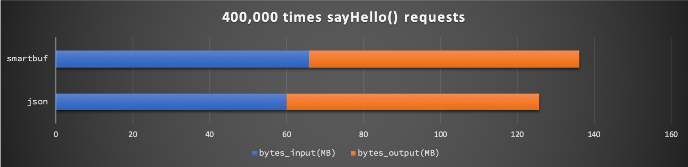
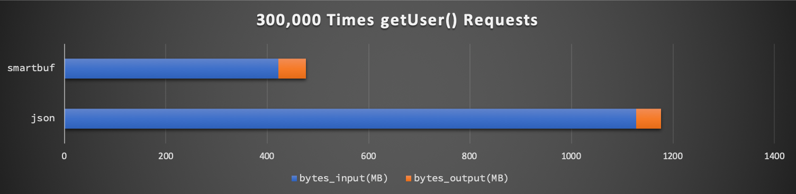
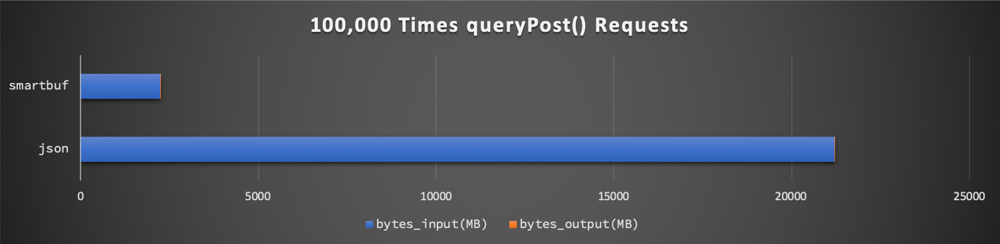

# smartbuf-springcloud  [](https://travis-ci.org/smartbuf/smartbuf-dubbo)

`smartbuf-springcloud`是一个基于`smartbuf`的`spring-cloud`序列化插件。

# [SmartBuf](https://github.com/smartbuf/smartbuf-java)介绍

`smartbuf`是一种新颖、高效、智能、易用的跨语言序列化框架，它既拥有不亚于protobuf的高性能， 也拥有与json相仿的通用性、可扩展性、可调试性等。

在`Java`语言生态中，它通过以下插件支持多种`RPC`框架:

 + [`smartbuf-dubbo`](https://github.com/smartbuf/smartbuf-dubbo): 为`dubbo`提供了`stream`模式的序列化扩展插件
 + [`smartbuf-springcloud`]((https://github.com/smartbuf/smartbuf-springcloud)): 为`spring-cloud`提供了`packet`模式的序列化扩展插件

# `smartbuf-springcloud`介绍

它内部封装了[`smartbuf`](https://github.com/smartbuf/smartbuf-java)序列化框架的`packet`模式，
通过自定义的`SmartbufMessageConverter`向`spring`容器中暴露了一个名为`application/x-smartbuf`的`HTTP`消息编码解码器。

这个新增的`application/x-smartbuf`格式在复杂对象的数据传输过程中，可以提供不亚于`protobuf`的高性能。

# `application/x-smartbuf`

`smartbuf-springcloud`源代码中有一个名为的`META-INFO/spring.factories`的配置文件，
它提供了一个名为`SmartbufAutoConfiguration`的自定义`Auto-Configuration`，
`spring-boot`初始化时会主动扫描并注册它，因此不需要你做任何额外的配置。
更多资料请参考[SpringBoot文档](https://docs.spring.io/autorepo/docs/spring-boot/2.0.0.M3/reference/html/boot-features-developing-auto-configuration.html)。

`SmartbufAutoConfiguration`会向`spring`容器中增加一个新的`SmartbufMessageConverter`对象，
它是一个自定义的`HttpMessageConverter`，它的`MediaType`是`application/x-smartbuf`。

`spring-mvc`启动后会把这个新增的`HttpMessageConverter`加入`messageConverters`中，
如果后续`http`请求的头信息中包括`accept: application/x-smartbuf`或`content-type: application/x-smartbuf`，
则`spring-mvc`会将该请求的`OutputStream`编码或`InputStream`解码委托给`SmartbufMessageConverter`处理。

整个过程和`application/json`的实现原理类似，不同之处在于`application/x-smartbuf`底层采用了另外一种序列化方案: 
[SmartBuf](https://github.com/smartbuf/smartbuf-java)

***总结：你不需要做任何额外的配置，此插件会自动向`spring-mvc`中注册一个名为`application/x-smartbuf`的数据编码解码器，
它对于正常的`http`请求没有任何影响，只有指定了`accept`或`content-type`头信息采用激活它***

# 实例演示

本章节通过一个实例，介绍如何将`smartbuf-springcloud`引入自己的工程中，以及如何在代码中使用它。

## 增加Maven依赖

你可以通过以下`maven`坐标添加`smartbuf-springcloud`的依赖：

```xml
<dependency>
  <groupId>com.github.smartbuf</groupId>
  <artifactId>smartbuf-springcloud</artifactId>
  <version>1.0.0</version>
</dependency>
```

## 使用`application/json`通信

众所周知，`feign`底层使用`http`与服务端的`spring-mvc`进行通信。以实际举例，服务端的Controller可能类似这样：

```java
@RestController
public class DemoController {
    @PostMapping("/hello")
    public String sayHello(String name) { return "hello " + name; }
}
```

调用方可以通过声明这样的`FeignClient`与之通信：

```java
@FeignClient(name = "demo")
public interface DemoClient {
    @PostMapping(value = "/hello", consumes = "application/json", produces = "application/json")
    String hello(@RequestParam("name") String name);
}
```

调用方通过这个`DemoClient`请求服务端的`DemoController`时，
`feign`会根据接口中声明的`consumes`和`produces`，向服务端发送类似于这样的请求：

```text
=== MimeHeaders ===
accept = application/json
content-type = application/json
user-agent = Java/1.8.0_191
connection = keep-alive
```

服务端的`spring-mvc`会根据头信息中的`accept`和`content-type`，确定使用`application/json`来执行`input`的解码和`output`的编码。

## 使用`application/x-smartbuf`替换`application/json`

如前文所言，`smartbuf-springcloud`会自动向`spring-mvc`中注册一个名为`application/x-smartbuf`的编码解码器，
因此在引入`maven`依赖之后，不需要做任何额外的配置。

你只需要将`DemoClient`修改为这样，注意`consumes`和`produces`的变化:

```java
@FeignClient(name = "demo")
public interface DemoClient {
    @PostMapping(value = "/hello", consumes = "application/x-smartbuf", produces = "application/x-smartbuf")
    String hello(@RequestParam("name") String name);
}
```

改动之后，`feign`就会使用新的`application/x-smartbuf`方式来与服务端`spring-mvc`进行通信，此时头信息就类似这样：

```text
=== MimeHeaders ===
accept = application/x-smartbuf
content-type = application/x-smartbuf
user-agent = Java/1.8.0_191
connection = keep-alive
```

更妙的是，你可以同时创建两个方法，让`application/json`与`application/x-smartbuf`共存：

```java
@FeignClient(name = "demo")
public interface DemoClient {
    @PostMapping(value = "/hello", consumes = "application/json", produces = "application/json")
    String helloJSON(@RequestParam("name") String name);

    @PostMapping(value = "/hello", consumes = "application/x-smartbuf", produces = "application/x-smartbuf")
    String helloSmartbuf(@RequestParam("name") String name);
}
```

客户端可以通过`helloJSON`使用`application/json`编码方式，通过`helloSmartbuf`使用`application/x-smartbuf`编码方式，
而服务端会根据请求方指定的编码类型自动进行切换。

具体演示代码在此工程的`demo`子模块中，你可以直接`checkout`到本地执行。

# 性能对比

`smartbuf`的优点在于其分区序列化所带来的高压缩率，尤其是面对复杂对象、数组时，它的空间利用率远超其他序列化方案。

对于RPC而言，序列化耗时往往是纳秒级，而逻辑处理、数据传输往往是毫秒级的，因此以下测试将采用单线程测试相同接口、相同次数的调用下，
`json`与`smartbuf`的数据传输量和耗时的差别。

下面我们通过三个不同类型的接口测试一下`json`与`smartbuf`的区别。

## `hello`测试

`hello`即前文提到的`helloJson`和`helloSmartbuf`接口，输入输出参数都是`String`，接口内部代码逻辑非常简单。

单线程循环调用`400,000`次总耗时分别为：

 + `JSON`: **169秒**
 + `SmartBuf`: **170秒**

网络输入(`bytes_input`)输出(`bytes_output`)总量分别为：



可以看到`json`与`smartbuf`的差别非常小，由于`smartbuf`需要额外几个字节描述数据信息，因此网络流量稍微多了一点点。

## `getUser`测试

`getUser`接口的实现方式如下：

```java
@RestController
public class DemoController {
    private UserModel user = xxx; // initialized at somewhere else

    @PostMapping("/getUser")
    public UserModel getUser(Integer userId) { return user; }
}
```

其中`user`是一个专门用于测试的、随机分配的对象，其具体模型可以查阅源码中的`UserModel`类。

客户端、调用方的`FeignClient`定义如下：

```java
@FeignClient(name = "demo")
public interface DemoClient {
    @PostMapping(value = "/getUser", consumes = "application/json", produces = "application/json")
    UserModel getUserJSON(@RequestParam("userId") Integer userId);

    @PostMapping(value = "/getUser", consumes = "application/x-smartbuf", produces = "application/x-smartbuf")
    UserModel getUserSmartbuf(@RequestParam("userId") Integer userId);
}
```

单线程循环调用`300,000`次的总耗时分别为：

 + `JSON`: **162秒**
 + `SmartBuf`: **149秒**

网络输入(`bytes_input`)输出(`bytes_output`)总量分别为：



可以看到请求参数`userId`数据类型单一，因此`json`和`smartbuf`所使用的网络流量几乎一样。
而返回结果`UserModel`是一个比较复杂的对象，因此`json`网络资源消耗量是`smartbuf`的将近**三倍**。

因为测试环境为`localhost`，网络传输耗时对接口的耗时没有太大影响。

## `queryPost`测试

`queryPost`接口的实现方式如下：

```java
@RestController
public class DemoController {
    private List<PostModel> posts = xxx; // initialized at somewhere else

    @PostMapping("/queryPost")
    public List<PostModel> queryPost(String keyword) { return posts; }
}
```

此接口返回值`posts`是一个预先分配的、用于测试的`PostModel`数组，此数组长度为固定的`100`，其具体模型及初始化可以查阅源码。

客户端、调用方的`FeignClient`定义如下：

```java
@FeignClient(name = "demo")
public interface DemoClient {
    @PostMapping(value = "/queryPost", consumes = "application/json", produces = "application/json")
    List<PostModel> queryPostJSON(@RequestParam("keyword") String keyword);

    @PostMapping(value = "/queryPost", consumes = "application/x-smartbuf", produces = "application/x-smartbuf")
    List<PostModel> queryPostSmartbuf(@RequestParam("keyword") String keyword);
}
```

单线程循环调用`100,000`次的总耗时分别为：

 + `JSON`: **195秒**
 + `SmartBuf`: **155秒**

网络输入(`bytes_input`)输出(`bytes_output`)总量分别为：



可以看到请求参数`keyword`数据类型单一，因此`json`和`smartbuf`所使用的网络流量几乎一样。
而返回结果`List<PostModel>`是一个复杂对象的大数组，因此`json`网络资源消耗量是`smartbuf`的将近**十倍**。

因为测试环境为`localhost`，网络传输耗时对接口的耗时没有太大影响。

# 总结

在输入输出数据格式都非常简单的`RPC`接口调用中，此插件所提供的`application/x-smartbuf`编码没有任何性能优势。

当接口数据中存在复杂对象、数组、集合等较大数据时，使用`x-smartbuf`可以大幅降低接口输入输出的字节流大小，
比如在上文`queryPost`测试中，使用`x-smartbuf`时网络输入输出字节总量仅为`json`的**十分之一**。

难能可贵的是，实际应用中`x-smartbuf`与`json`即可以共存，也可以无缝切换。
比如对于某些简单接口，可以直接采用简单的`json`编码，而对于数据量比较大的复杂接口，可以采用高效率的`x-smartbuf`编码进行性能优化。
再比如需要开发测试时使用`json`编码，生产环境发布时再采用`x-smartbuf`编码。

# License

MIT
